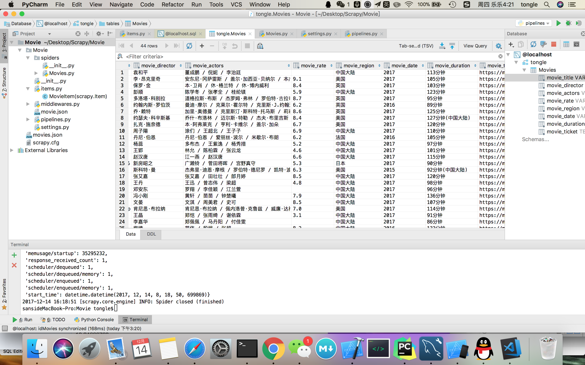

### 豆瓣网电影信息爬取

#### items.py中

    # 电影名
    movie_title = Field()
    # 导演
    movie_director = Field()
    # 主演
    movie_actors = Field()
    # 评分
    movie_rate = Field()
    # 地点
    movie_region = Field()
    # 上映时间
    movie_date = Field()
    # 时长
    movie_duration = Field()
    # 描述
    movie_ticket = Field()
    
    
#### settings.py中

1、 json存储

2、 mysql存储

    ITEM_PIPELINES = {
       'Movie.pipelines.MoviePipeline': 300,
       'Movie.pipelines.MovieMySQLPipeline':400
    }

     DOWNLOADER_MIDDLEWARES = {
    'scrapy.downloadermiddlewares.useragent.UserAgentMiddleware': None,
     }
     
#### spiders 的Movies中

* 导入头文件

        import scrapy
        from scrapy.http import Request
        from scrapy.spiders import Spider
        from scrapy.selector import Selector
        from Movie.items import MovieItem

* 编写爬取代码

注：
name：名称
allowed_domains：爬取范围
start_urls：爬取地址

    class DoubanSpider(Spider):
          name = "douban"
          allowed_domains = ["movie.douban.com"]
          start_urls = ["https://movie.douban.com"]

          def parse(self,response):
              items = []
              sel = Selector(response)
              sites = sel.xpath('//div[@id="screening"]/div[@class="screening-bd"]/ul/li')
              for site in sites:
                  item = MovieItem()
                  item['movie_title'] = site.xpath('@data-title').extract()
                  item['movie_director'] = site.xpath('@data-director').extract()
                  item['movie_actors'] = site.xpath('@data-actors').extract()
                  item['movie_rate'] = site.xpath('@data-rate').extract()
                  item['movie_region'] = site.xpath('@data-region').extract()
                  item['movie_date'] = site.xpath('@data-release').extract()
                  item['movie_duration'] = site.xpath('@data-duration').extract()
                  item['movie_ticket'] = site.xpath('@data-ticket').extract()
                  items.append(item)
                print items, '.....'
                return items
                
#### pipelines.py

1. 导入头文件

        import json
        import codecs
        import MySQLdb
        from MySQLdb import cursors
        from twisted.enterprise import adbapi

2. json存储

注：

movies.json:文件名称格式

encoding:文本格式

    class MoviePipeline(object):
          def __init__(self):
               self.file = codecs.open('movies.json', 'w', encoding='utf-8')

          def process_item(self, item, spider):
              line = json.dumps(dict(item)) + '\n'
              self.file.write(line.decode("unicode_escape"))
              return item

3. 数据库存储

注：
host：主机名
db：数据库名称
user：用户名
passwd：密码

     class MovieMySQLPipeline(object):
           def __init__(self):
               self.dbpool = adbapi.ConnectionPool("MySQLdb",

                                            host="localhost",
                                            db="tongle",
                                            user="root",
                                            passwd="",
                                            cursorclass=MySQLdb.cursors.DictCursor,
                                            charset="utf8",
                                            use_unicode=True
                                            )

    def process_item(self, item, spider):
        query = self.dbpool.runInteraction(self._conditional_insert, item)
        # query.addErrback(self.handle_error)
        return item

    def _conditional_insert(self, tb, item):
        print  '------'
        # 删除所有数据
        # tb.execute("DELETE FROM TABLE_NAME ")

        # 插入数据，prince_link[0]取出list列表中的数据
        
        M_title = 0
        director = 0
        actors = 0
        rate = 0
        region = 0
        region = 0
        date = 0
        duration = 0
        ticket = 0
        # 防止list数据为空
        if len(item['movie_title']):
            M_title = item['movie_title'][0]
        else:
            print '...'
        if len(item['movie_director']):
            director = item['movie_director'][0]
        else:
            print '...'
        if len(item['movie_actors']):
            actors = item['movie_actors'][0]
        else:
            print '...'
        if len(item['movie_rate']):
            rate = item['movie_rate'][0]
        else:
            print '...'
        if len(item['movie_region']):
            region = item['movie_region'][0]
        else:
            print '...'
        if len(item['movie_date']):
            date = item['movie_date'][0]
        else:
            print '...'
        if len(item['movie_duration']):
            duration = item['movie_duration'][0]
        else:
            print '...'
        if len(item['movie_ticket']):
            ticket = item['movie_ticket'][0]
        else:
            print '...'

        tb.execute("INSERT INTO  tongle.Movies(movie_title, movie_director, movie_actors, movie_rate, movie_region, movie_date, movie_duration, movie_ticket) VALUES ('%s', '%s', '%s','%s', '%s', '%s','%s', '%s')" % (
            M_title,
             director,
             actors,
             rate,
             region,
             date,
             duration,
             ticket ))

              
              